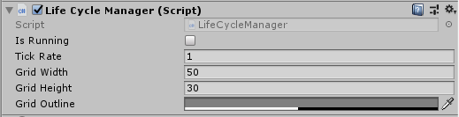

# conways-game-of-life
A unity app that demonstrates the rules of conway's game of life

Description
----
Cells states can either an *alive* or *dead* state. This state of each cell is determined by a set of four rules:
1. Any live cell with fewer than two live neighbors dies, as if by underpopulation.
2. Any live cell with two or three live neighbors lives on to the next generation.
3. Any live cell with more than three live neighbors dies, as if by overpopulation.
4. Any dead cell with exactly three live neighbors becomes a live cell, as if by reproduction.

The "game" starts by having some cells alive and then plays out on its own, changing cells states every *generation* or *tick*. In some cases this can produce some interesting patterns of behavior.

More details can be found on [Wikipedia](https://en.wikipedia.org/wiki/Conway%27s_Game_of_Life "Conway's Game of Life").

Usage
----
Inside of the scene the only thing required is the main camera. The *LifeCycleManager* script is then attached to that main camera. The grid is generated and the camera adjust to fit the full grid inside of it.

A single mouse click inside a cell will toggle its *alive* or *dead* state. The game can be stated and paused at any point by unchecking **IsRunning** variable for the *LifeCycleManager* OR by pressing the space bar.

Parameters
----

| Variable   | Type       | Description |
| ---------- |------------| -------------------------------|
| IsRunning  | `<string>` | Set the game state as running or stopped. |
| TickRate   | `<float>`  | Set the time between each generation or tick. |
| GridWidth  | `<float>`  | Set the width of the world grid. |
| GridHeight | `<float>`  | Set the height of the world grid. |
| GridColor  | `<boolean>` | Set the color of the guide lines of the grid. |
